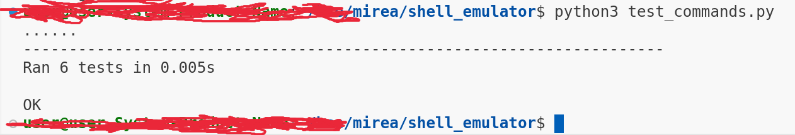
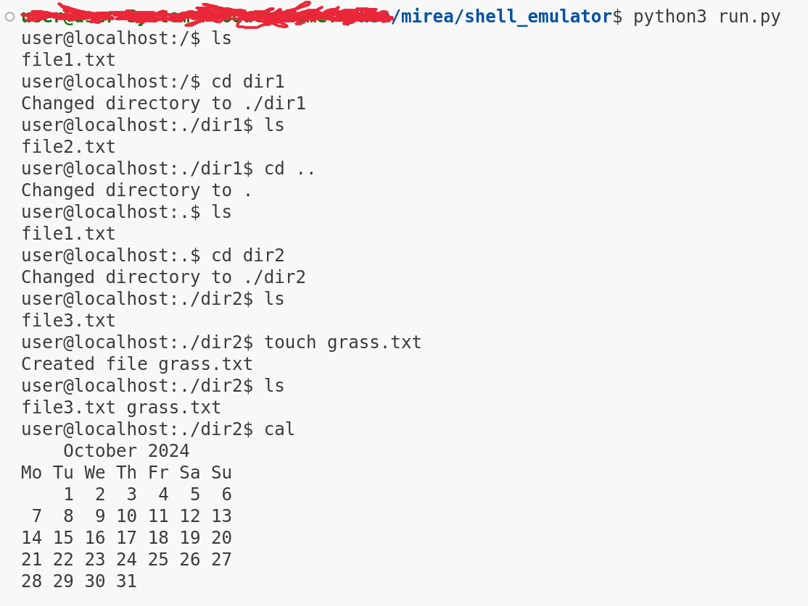
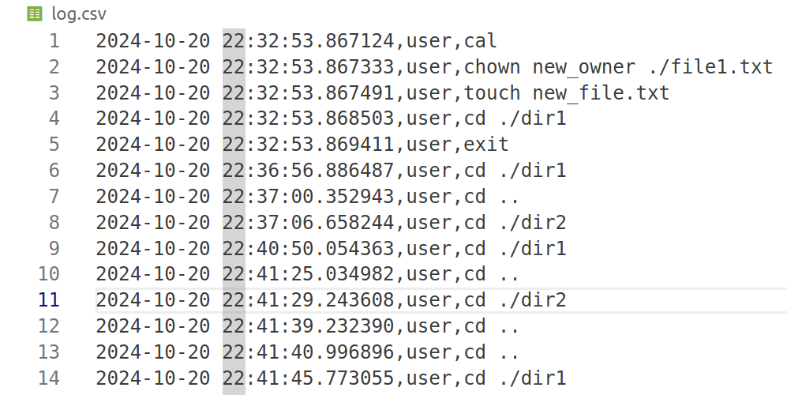
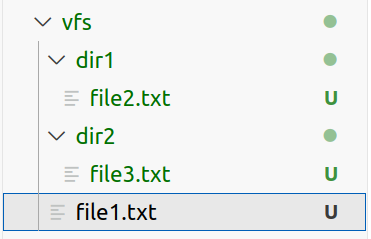

## Эмулятор консоли

### Поддерживаемые команды

- **ls** - вывод текущей директории
- **cd** - смена текущей директории
- **touch** - см [wiki](https://ru.wikipedia.org/wiki/Touch)
- **cal** - выводит календаря на текущий месяц
- **chown** - смена владельца файла
- **exit** - выход из эмулятора

### Тестирование
Производилось с помощью ```unittest```. Запуск тестов - ```python3 test_commands.py```



### Ручной запуск
```python3 run.py``` запускает эмулятор в стандартном режиме




### Логи
Логи пишутся в файл ```log.csv```



### Тестовая папка
Запускаемый тест имеет вид

